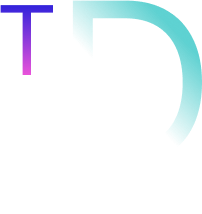

<!-- Improved compatibility of back to top link: See: https://github.com/othneildrew/Best-README-Template/pull/73 -->

[![Contributors][contributors-shield]][contributors-url]
[![Forks][forks-shield]][forks-url]
[![Stargazers][stars-shield]][stars-url]
[![Issues][issues-shield]][issues-url]
[![LinkedIn][linkedin-shield]][linkedin-url]

<!-- PROJECT LOGO -->
 

  

  <h3 align="center">TriDimeX</h3>

  

    3D model viewer for your scanned models!
     
     
    <a href="https://github.com/Rohan69420/TriDimeX">View Demo</a>
    ·

<!-- ABOUT THE PROJECT -->
## About The Project

This project is a fifth-semester project for Computer Graphics. It is a demonstration of the 3D capabilities of OpenGL. The primary application of this project lies in its usage as a viewer for the 3D WaveFront models that can be created using modern smartphone applications.

(<a href="#readme-top">back to top</a>)

### Built With

* [![FreeGLUT][FreeGLUT]][FGL-url]
* [![GLEW][GLEW]][GLEW-url]
* [![LodePNG][LodePNG]][lode-url]
* [![C++][C++]][]

(<a href="#readme-top">back to top</a>)

<!-- GETTING STARTED -->
## Getting Started

To get a local copy up and running follow these simple example steps.

### Prerequisites

If you are a Linux user then run 

sudo apt-get install mesa-common-dev libglu1-mesa-dev freeglut3-dev

For windows, you can install the dependencies using MinGW.

### Build

With the necessary libraries installed, you can build this project by using the build.sh script file or the batch
file and finally using 'make' command.

(<a href="#readme-top">back to top</a>)

<!-- CONTACT -->
## Contact

Rohan Maharjan 

Project Link: [https://github.com/Rohan69420/TriDimeX](https://github.com/Rohan69420/TriDimeX)

(<a href="#readme-top">back to top</a>)

<!-- ACKNOWLEDGMENTS -->
## Acknowledgments

You can learn more about such projects through the following resources

* [FreeGLUT Documentation](https://freeglut.sourceforge.net/docs/api.php)
* [OpenGL Video Tutorials](https://www.youtube.com/@WHKnightZ)
* [Models To View](https://www.turbosquid.com/Search/3D-Models/)
* [Blender To Make CHanges To Model](https://www.blender.org/)

(<a href="#readme-top">back to top</a>)

<!-- MARKDOWN LINKS & IMAGES -->
[contributors-shield]: https://img.shields.io/github/contributors/othneildrew/Best-README-Template.svg?style=for-the-badge
[contributors-url]: https://github.com/Rohan69420/TriDimeX/graphs/contributors
[forks-shield]: https://img.shields.io/github/forks/othneildrew/Best-README-Template.svg?style=for-the-badge
[forks-url]: https://github.com/Rohan69420/TriDimeX/network/members
[stars-shield]: https://img.shields.io/github/stars/othneildrew/Best-README-Template.svg?style=for-the-badge
[stars-url]: https://github.com/Rohan69420/TriDimeX/stargazers
[issues-shield]: https://img.shields.io/github/issues/othneildrew/Best-README-Template.svg?style=for-the-badge
[issues-url]: https://github.com/Rohan69420/TriDimeXissues
[license-shield]: https://img.shields.io/github/license/othneildrew/Best-README-Template.svg?style=for-the-badge
[license-url]: https://github.com/Rohan69420/TriDimeX/blob/master/LICENSE.txt
[linkedin-shield]: https://img.shields.io/badge/-LinkedIn-black.svg?style=for-the-badge&logo=linkedin&colorB=555
[linkedin-url]: https://linkedin.com/in/ro-rohu
[product-screenshot]: Images/App.png

[FGL-url]: https://freeglut.sourceforge.net/
[GLEW-url]: https://glew.sourceforge.net/
[lode-url]: https://lodev.org/lodepng/